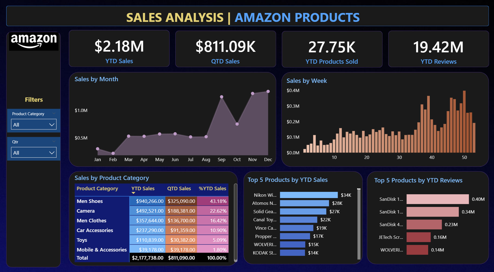
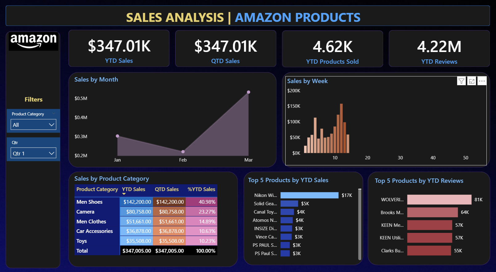
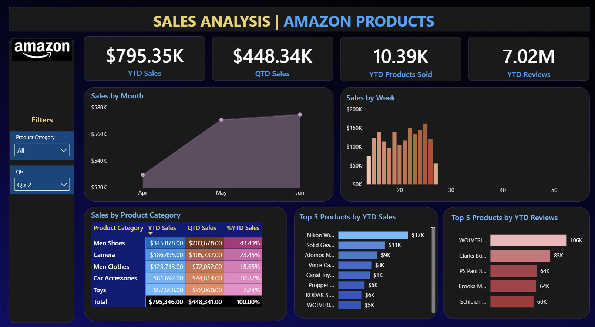
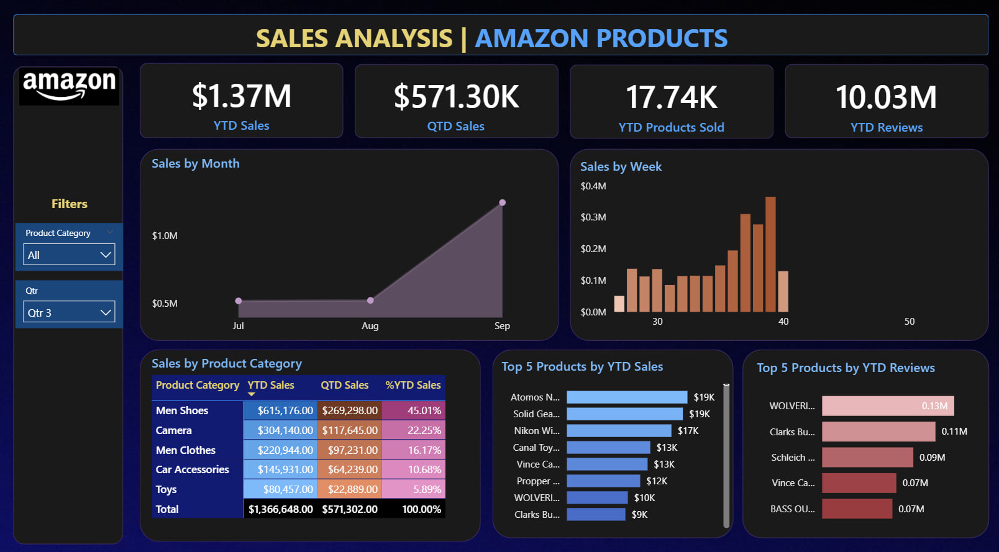
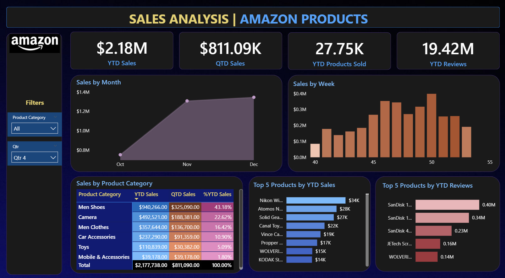

# Amazon Sales Analysis Dashboard (Power BI)

This project presents an Amazon sales analysis dashboard developed using Power BI aiming to provide clear, actionable insights into sales performance, product trends, and customer engagement. 

---

## Table of Contents
*   [Project Objectives](#project-objectives)
*   [Tools Utilized](#tools-utilized)
*   [Methodology](#methodology)
    *   [Data Preparation](#data-preparation)
    *   [Date Table Creation](#date-table-creation)
    *   [Data Modelling](#data-modelling)
    *   [Dashboard Design](#dashboard-design)
    *   [Key Performance Indicators (KPIs)](#key-performance-indicators-kpis)
    *   [Chart Development](#chart-development)
*   [Dashboard Insights from Data](#dashboard-insights-from-data)
    *   [Overall Dashboard View](#overall-dashboard-view)
    *   [Quarter 1 (Jan-Mar)](#quarter-1-jan-mar)
    *   [Quarter 2 (Apr-Jun)](#quarter-2-apr-jun)
    *   [Quarter 3 (Jul-Sep)](#quarter-3-jul-sep)
    *   [Quarter 4 (Oct-Dec)](#quarter-4-oct-dec)
*   [Key Findings and Conclusion](#key-findings-and-conclusion)
*   [Recommendations](#recommendations)
*   [Acknowledgement](#acknowledgement)

---

## Project Objectives

The primary objectives of this project include:
*   **Data Cleaning and Preparation:** Transforming raw sales data into a usable format.
*   **Power BI Dashboard Development:** Creating interactive visualizations to monitor sales trends and key performance indicators (KPIs).
*   **Insight Generation:** Identifying significant patterns, top-performing products, and seasonal trends within the sales data.
*   **Skill Application:** Applying Power BI functionalities, including Power Query for data transformation, DAX for custom calculations, and various visualization techniques.

---

## Tools Utilized

*   **Microsoft Excel:** Used for gathering preliminary insights from source data storage.
*   **Power BI Desktop:** The primary tool for data modeling, visualization, and dashboard creation.

---

## Methodology

This section outlines the systematic approach undertaken to develop the Amazon Sales Analysis Dashboard.

### Data Preparation

The project commenced with sourcing an Excel dataset containing approximately 89,082 rows of Amazon sales data. This data was imported into Power BI, where Power Query was utilized to assess and enhance data quality. Checks for blank values, null entries, and duplicates were performed, ensuring the dataset's integrity and readiness for analysis.

### Date Table Creation

To facilitate robust time-intelligence functions and granular temporal analysis, a dedicated Date Table was generated within Power BI. This table was populated using DAX (Data Analysis Expressions), incorporating columns for "Month Name" and "Month Number" to enable accurate chronological sorting of monthly data.

### Data Modelling

A crucial step involved establishing a "One-to-Many" relationship between the primary Amazon sales data table and the newly created Date Table. This relationship, configured in the Model View, ensures that each unique date in the Date Table can correspond to multiple sales records in the Amazon data, forming a cohesive data model for comprehensive analysis.

### Dashboard Design

The dashboard's aesthetic and functional design prioritized clarity and user-friendliness. A dark background theme was selected, complemented by a prominent title: "SALES ANALYSIS | AMAZON PRODUCTS." Interactive slicers for "Product Category" and "Quarter" were integrated, empowering users to dynamically filter and explore data from various perspectives.

### Key Performance Indicators (KPIs)

Four essential Key Performance Indicators (KPIs) were developed using DAX to provide a high-level overview of business performance:
*   **YTD Sales (Year-to-Date Sales):** Monitors cumulative revenue performance from the beginning of the current year.
*   **QTD Sales (Quarter-to-Date Sales):** Tracks cumulative sales figures from the start of the current quarter.
*   **YTD Products Sold:** Analyzes the total volume of products sold year-to-date.
*   **YTD Reviews:** Assesses customer feedback and satisfaction through the total number of reviews received year-to-date.

### Chart Development

A variety of visualizations were implemented to present detailed sales insights:
*   **Sales by Month (Area Chart):** Illustrates monthly sales trends, aiding in the identification of seasonal patterns.
*   **Sales by Week (Column Chart):** Displays weekly sales data to highlight shorter-term fluctuations and performance insights.
*   **Sales by Product Category (Matrix Table):** Provides a high-level overview of sales distribution across different product categories, including a percentage of grand total for comparative analysis.
*   **Top 5 Products by YTD Sales (Bar Chart):** Showcases the leading products based on year-to-date sales, emphasizing key revenue generators.
*   **Top 5 Products by YTD Reviews (Bar Chart):** Identifies products with the highest number of year-to-date reviews, indicating strong customer engagement and preference.

---

## Dashboard Insights from Data

The dashboard provides a comprehensive view of Amazon's sales performance, revealing critical trends and product dynamics.

### Overall Dashboard View

*   **Total Performance:** The dashboard indicates a **Year-to-Date (YTD) Sales of $2.18 Million**, with **Quarter-to-Date (QTD) Sales at $811.09 Thousand**. A total of **27.75 Thousand products** have been sold, accompanied by **19.42 Million reviews** year-to-date.
*   **Seasonal Sales Spike:** A notable observation is the consistent sales performance from January to August, followed by a significant **surge in sales from September to December**. November and December emerge as the peak months, strongly suggesting a correlation with holiday shopping seasons.
*   **Weekly Trends:** The weekly sales distribution further corroborates this seasonal pattern, with heightened sales activity evident in the latter weeks of the year (approximately weeks 40-52).
*   **Top Product Categories:**
    *   **Men Shoes** consistently lead in sales, contributing **43.18% of total YTD sales** ($940,266).
    *   **Camera** ranks second, accounting for **22.62%** ($492,521) of YTD sales.
    *   **Mobile & Accessories** represent the lowest sales contribution at **1.80%** ($39,178).
*   **Best-Selling Products:** Specific products such as "Nikon Wi..." are identified as top performers in sales, while "SanDisk 1..." products receive the highest volume of customer reviews.

---

### Quarter 1 (Jan-Mar)

*   **Initial Performance:** YTD and QTD sales align at **$347.01 Thousand**. During this quarter, **4.62K products** were sold, and **4.22M reviews** were accumulated.
*   **Monthly Trend:** Sales commenced robustly in January, experienced a slight dip in February, and subsequently recovered in March.
*   **Category Dominance:** **Men Shoes** maintained their leading position, contributing **40.98%** of the quarter's sales.

---

### Quarter 2 (Apr-Jun)

*   **Sustained Growth:** YTD Sales advanced to **$795.35 Thousand**, with QTD Sales for this period reaching **$448.34 Thousand**. Product sales increased to **10.39K**, and reviews grew to **7.02M**.
*   **Monthly Trend:** A steady upward trend in sales was observed from April through June.
*   **Category Consistency:** **Men Shoes** continued to be the top-performing category, contributing **43.49%** of sales.

---

### Quarter 3 (Jul-Sep)

*   **Pre-Holiday Momentum:** YTD Sales reached **$1.37 Million**, with QTD Sales for this quarter recorded at **$571.30 Thousand**. Products sold escalated to **17.74K**, and reviews surpassed **10.03M**.
*   **Monthly Trend:** This quarter demonstrated a significant acceleration in sales, particularly from August to September, indicating the onset of increased consumer activity prior to the holiday season.
*   **Category Leadership:** **Men Shoes** sustained their leadership, accounting for **45.01%** of YTD sales.

---

### Quarter 4 (Oct-Dec)

*   **Peak Performance:** The final quarter reflects the cumulative annual performance, with YTD Sales peaking at **$2.18 Million** and QTD Sales for this quarter being the highest at **$811.09 Thousand**. Products sold reached **27.75K**, and reviews totaled **19.42M**.
*   **Monthly Trend:** Sales exhibited a dramatic surge from October to December, with November and December marking the absolute highest sales volumes, unequivocally establishing this as the strongest sales period.
*   **Category Dominance:** **Men Shoes** consistently remained the top category, contributing **43.18%** of the total YTD sales.

---

## Key Findings and Conclusion

*   **Pronounced Seasonal Sales:** Amazon experiences a substantial increase in sales during the fourth quarter (Q4), particularly in November and December. This trend is strongly associated with holiday shopping periods.
*   **Consistent Product Category Strength:** The "Men Shoes" product category demonstrates exceptional and sustained performance across all quarters, consistently contributing nearly half of the total sales.
*   **High Customer Engagement:** The impressive volume of YTD reviews (19.42 Million) underscores active customer interaction and feedback, which can be a valuable asset.
*   **Early Year Sales Patterns:** The initial three quarters generally exhibit more stable and comparatively lower sales volumes compared to the significant growth observed in Q4.

---

## Recommendations

Based on the analytical insights derived from the dashboard, the following recommendations are proposed:

1.  **Optimized Inventory Management for Q4:** Implement enhanced inventory forecasting and management strategies for high-demand product categories, especially "Men Shoes" and "Camera," to ensure adequate stock levels during the peak sales period of September to December.
2.  **Strategic Promotions for Off-Peak Months:** Develop and execute targeted promotional campaigns or discount strategies for leading product categories during the historically slower months (January-August) to stimulate demand and maintain sales momentum.
3.  **Enhanced Focus on Underperforming Categories:** Investigate strategies to boost sales in categories with lower contributions, such as "Mobile & Accessories." This could involve exploring new product bundles, targeted marketing, or competitive pricing adjustments.
4.  **Leverage Customer Review Data:** Capitalize on the extensive customer review data by prominently featuring top-rated products and testimonials in marketing efforts to build consumer trust and drive further sales.
5.  **In-depth Analysis of Top Products:** Conduct further granular analysis into the success factors of specific top-performing products (e.g., "Nikon Wide Angle AF Lens...", "SanDisk 16 GB Memory Card...") to identify transferable strategies that can be applied across other product lines.

This effectively demonstrates the application of Power BI for transforming raw sales data into strategic business intelligence, offering valuable insights for decision-making and showcasing foundational data analysis capabilities.

---

## Acknowledgement

Special thanks to [Swapnjeet S](https://www.linkedin.com/in/swapnjeet-s-58a673273/) for providing the data required for analysis and guiding throughout this project, as outlined in this [video tutorial](https://www.youtube.com/watch?v=QhrnZGoSK70).

---
